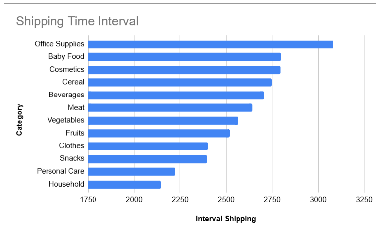
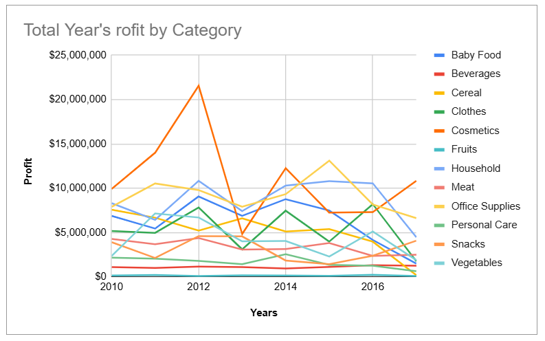
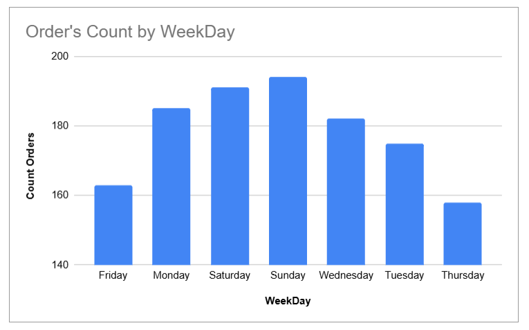
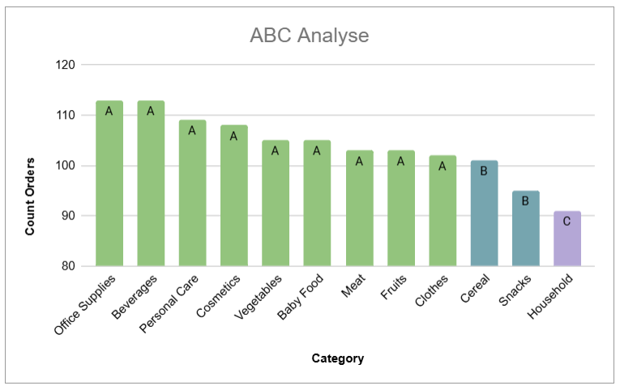

# Company Sales Analysis in Google Sheets

## Project Overview

This project performs a complete sales analysis workflow entirely in Google Sheets.
The dataset contains 1,248 transactional records across 45 countries and 12 product categories spanning 2010–2017.
The analysis covers revenue, profit, geographic distribution, shipping intervals, time-based trends, and ABC classification.

🔗 [Open in Google Sheets](https://docs.google.com/spreadsheets/d/1RDdd4DMb8DeU1L71Ke2XcEY7FSF2gu0dZbWhUQ1O3es/edit?usp=sharing)

## Tools & Technologies

- Google Sheets (formulas, pivot tables, charts)

- ABC Analysis methodology

## Dataset

The project uses three source sheets merged into a single analytical dataset:

- **Events** — 1,248 order records with order/ship dates, priority, country code, product ID, sales channel, units sold, unit price, unit cost

- **Products** — 12 product categories (Cereal, Household, Clothes, Beverages, Office Supplies, Fruits, Vegetables, Baby Food, Meat, Cosmetics, Snacks, Personal Care)

- **Countries** — 250 country records with region, sub-region, alpha codes

**Calculated metrics:** Total Revenue, Total Cost, Total Profit, Shipping Interval (days), Year, Month, WeekDay.

## Company Metrics

- Total orders: **1,248**

- Total profit: **$473,709,035**

- Countries covered: **45**

## Analysis & Key Insights

### Category Analysis

- **Office Supplies** leads by revenue (~$375M), followed by **Household** (~$275M) and **Cosmetics** (~$215M)

- **Fruits** has the lowest revenue across all categories

- Profit margins vary significantly between categories


### Sales Channel Analysis

- Online and Offline channels show very similar performance in revenue, cost, and profit

- Offline slightly exceeds Online in total revenue, but profit is nearly identical


### Shipping Interval Analysis

- **Office Supplies** has the longest total shipping time (~3,100 days), **Household** the shortest (~2,100 days)

- Shipping intervals vary across categories but show no direct correlation with profitability



### Profit Trends by Year

- Profit dynamics vary significantly across categories and years

- **Cosmetics** showed a sharp peak in 2012 (~$21M) followed by a decline

- **Office Supplies** and **Household** remain consistently among the top performers



### Weekday Analysis

- Largest number of orders: **Sunday** (~194), followed by **Saturday** (~191)

- Fewest orders: **Thursday** (~158) and **Friday** (~163)

- Greatest profit generated on: **Friday**



### ABC Analysis

- **9 categories** classified as A (up to ~77% cumulative share): Office Supplies, Beverages, Personal Care, Cosmetics, Vegetables, Baby Food, Meat, Fruits, Clothes

- **2 categories** classified as B: Cereal, Snacks

- **1 category** classified as C: Household

- The distribution is relatively even — no single category dominates disproportionately



## How to View

1. Open the [Google Sheets spreadsheet](https://docs.google.com/spreadsheets/d/1RDdd4DMb8DeU1L71Ke2XcEY7FSF2gu0dZbWhUQ1O3es/edit?usp=sharing)

2. Or download the `.xlsx` file from this repository

## Spreadsheet Structure

The workbook contains 14 sheets:

- `dataset_events` — source transactional data

- `dataset_products` — product catalog

- `dataset_countries` — country reference

- `Company metrics` — key business KPIs

- `Category analyse` — profit by category

- `Country&region analyse` — geographic breakdown

- `Sales Channel analyse` — online vs offline

- `Interval Shipping Analyse` — shipping time analysis

- `Profit by Year and Months` — monthly profit trends

- `Profit by Year` — yearly profit by category

- `Count Orders by Month` — order volume trends

- `WeekDays Analyse` — day-of-week patterns

- `ABC Analyse` — ABC product classification

- `Data Visualization` — summary dashboard

## Project Structure

```
company-sales-analysis-google-sheets/
├── images/
│   ├── category_analyse.png
│   ├── sales_channel_analyse.png
│   ├── interval_shipping.png
│   ├── profit_by_year.png
│   ├── weekday_analyze.png
│   └── abc_analyze.png
├── Company_Analysis_in_GoogleSheet.xlsx
└── README.md
```
